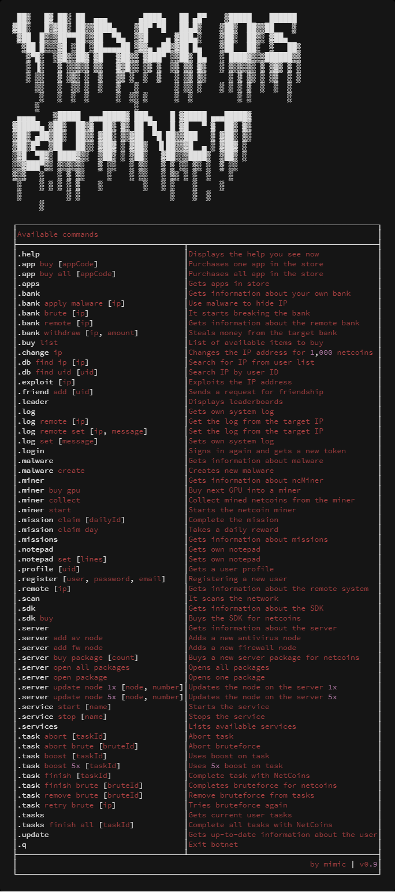
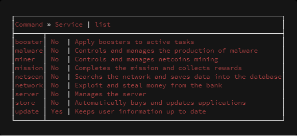

```
              __  __              __      ____  _____                             
      _   __ / / / /____ _ _____ / /__   / __ \/ ___/                             
     | | / // /_/ // __ `// ___// //_/  / / / /\__ \                              
     | |/ // __  // /_/ // /__ / ,<    / /_/ /___/ /                              
     |___//_/ /_/ \__,_/ \___//_/|_|   \____//____/                               
       ____          __                __                                         
      / __ ) ____   / /_ ____   ___   / /_                                        
     / __  |/ __ \ / __// __ \ / _ \ / __/                                        
 _  / /_/ // /_/ // /_ / / / //  __// /_                                          
(_)/_____/ \____/ \__//_/ /_/ \___/ \__/                                          
       __              ____          __     _  __         ______                  
      / /_   __  __   / __ \ ____   / /_   (_)/ /_ ___   / ____/____   _____ ____ 
     / __ \ / / / /  / / / // __ \ / __ \ / // __// _ \ / /    / __ \ / ___// __ \
    / /_/ // /_/ /  / /_/ // /_/ // / / // // /_ /  __// /___ / /_/ // /   / /_/ /
   /_.___/ \__, /   \____// .___//_/ /_//_/ \__/ \___/ \____/ \____//_/   / .___/ 
          /____/         /_/                                             /_/         
```
# vHack OS - Botnet
vHack OS is a mobile game. My Botnet works as a console client for windows / linux and bot at the same time.
The original idea was to create an application for command calls as well as in the game. Later, I extended it with a lot of things, including services, so it became a full-fledged bot.
For the game server, Botnet behaves like a human, so when the settings are correct, the detection is almost zero.

## Join [Discord](https://discord.gg/Cdz39vu) for help, advice, chat, and more

### Information


[](https://discord.gg/Cdz39vu)

### Notice!
Even if the odds are small, I am not responsible for any damage caused by Botnet. Like a ban on an account, etc. If you use this application, you are aware of the potential consequences and all the risks associated with it.

### Application status and goals
- [x] Configuration, including comments, so everyone knows what they're doing
- [x] Support for ASCII output to console
- [x] Network Scanning
- [x] Exploit IP
- [x] Bruteforce Bank
- [x] Bypass the target firewall and try to break the bank even if you have a lower SDK
- [x] List of applications and their updates
- [x] View your own bank and bank on the target IP
- [x] Theft of money from a bank and hide IP using malware
- [x] Show a store where things are bought for money
- [x] IP change
- [x] Adding a friend to a friend
- [x] View leaderboards
- [x] Manage your system and target system log and, of course, change / delete
- [x] Sign in and get up-to-date account information
- [x] View malware + creation
- [x] View SDK information and buy for netcoins
- [x] Miner management that mines netcoins
- [x] View and complete missions
- [x] View and edit a notepad
- [x] View user profile by UID
- [x] New user registration
- [x] Obtaining information about the remote system
- [x] Complete server management - updating and buying nodes (1x, 5x), opening and buying packages
- [x] Task Management - using booster (1x, 5x), finish for netcoins, remove, abort, add, retr. And, of course, a list of tasks
- [x] Managing and controlling services (displaying their status, starting, stopping)
- [x] Multi-threaded processing of services
- [x] Links to the MySQL database + including the creation of a complete database schema
- [x] Support for revealing hidden IPs in a bank transaction (for this, you need a lot of data in the database)
- [x] GUI display support
- [x] Proxy server support

### Available services
- [x] Updating your profile and tasks
- [x] Check server, automatically updates and buys nodes. Opens and buys packages
- [x] Automatically creates malware
- [x] Updates applications according to configuration
- [x] Apply boosters to active tasks
- [x] Controls the miner. Collects a reward and starts a miner
- [x] Automatically completes a mission and collects a daily reward
- [x] Periodically scans the network and saves the result to the database
- [ ] Automatic exploit, bruteforce, log change and bank widthdraw

### What is stored in the database
- Network scanning (user name and UID, IP, level, firewall)
- Bank transaction (thanks to this there is a partial revelation of the hidden IP)
- System log on the target system

### How to use Botnet
1) The application uses the java version 10. If you do not have it, download it here - [Download](http://www.oracle.com/technetwork/java/javase/downloads/index.html)
2) Download the latest release of Botnet from github here and unpack - [Download](https://github.com/OphiteCorp/vhackos-botnet/releases)
3) Botnet is currently a console application, so you need to run it through the console
   - Put downloaded Botnet somewhere in your directory. For example `c:/botnet/botnet.jar`
   - Run the command line using `cmd` via `Win + R`
   - Go to the directory with `botnet.jar`. In our case `cd c:/botnet`
   - Run Botnet using `java -jar botnet.jar`
4) At first run, only configuration files are generated and applications are shut down. One file is called `botnet.properties`, which is the main configuration file for the application. To make Botnet work, we need to set up these things:
   - Fill `game.userName` with login to the game
   - Fill `game.password` with a password in the game
   - Optional
     - If you know your access token and user ID, fill in the following `game.fixed.access.token` and `game.fixed.user.uid`. This will allow you to sign up on another device at the same time (like a mobile phone)
5) Run Botnet again with the same command as before
6) When fully loaded, you can use the `.help` command to display the help (available commands)
7) Quit Botnet using the `.q` command. This is a safe way to properly terminate all services and update the cache
8) Enjoy your botting ;-)

### FAQ
- Can I run Botnet multiple times at the same time under one account?
  - Yes, if the same login name, password, access token and user ID are used. But it does not really make it more effective, but rather, there is a higher chance of getting a ban. Only if the second instance of Botnet did not use any services but served only for manual commands. That's safe then

- Is my login name and my password safe to enter into my configuration?
  - Yes. Besides vHack, your data is not sent anywhere else
  
- How do I get my access token and UID from my mobile?
  - First of all, you need to have root devices
  - Open a file manager and go to: `/data/data/cc.vhack.vhackxtmobile/shared_prefs` and edit file `vXTMobile.xml.xml`
  - You will find the `uid` and `accessstoken` values in the file. Then use them in Botnet
  
### Project information (v0.8)
```
-------------------------------------------------------------------------------
Language                     files          blank        comment           code
-------------------------------------------------------------------------------
Java                           211           2867           2162          12069
XML                             12              7              0           3306
Maven                            4             24              0            284
Markdown                         3             20              0             97
JSON                             1              0              0              9
-------------------------------------------------------------------------------
SUM:                           231           2918           2162          15765
-------------------------------------------------------------------------------
```
### A few application images




Huge image of v0.8 - [HERE](screens/botnet_v0.8_big.png)
