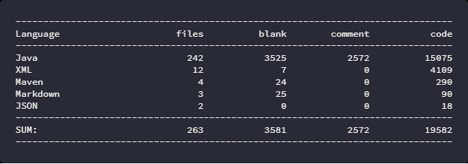
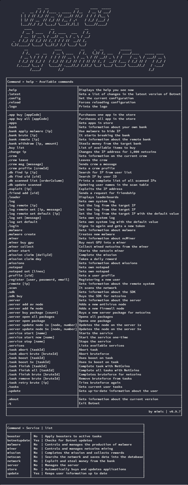

# vHack OS - Botnet
vHack OS is a mobile game. My Botnet works as a console client for windows / linux and bot at the same time.
The original idea was to create an application for command calls as well as in the game. Later, I extended it with a lot of things, including services, so it became a full-fledged bot.
For the game server, Botnet behaves like a human, so when the settings are correct, the detection is almost zero.

## Join [Discord](https://discord.gg/Cdz39vu) for help, advice, chat, and more

## Download latest [**HERE**](https://github.com/OphiteCorp/vhackos-botnet/releases/tag/botnetv098) (with changelog)

***

## The Future of Botnet
### My development on Botnet has ended and the development has taken over another division that has been developed by more people. Updates to Botnet will continue, but without my participation. Who would be interested in using Botnet, then come to the discord. Thanks.

***

### Information

### Notice!
Even if the odds are small, I am not responsible for any damage caused by Botnet. Like a ban on an account, etc. If you use this application, you are aware of the potential consequences and all the risks associated with it.

### Installation and startup instructions
Find on WIKI - [**HERE**](https://github.com/OphiteCorp/vhackos-botnet/wiki/How-to-install-and-run)

### FAQ
Find on WIKI - [**HERE**](https://github.com/OphiteCorp/vhackos-botnet/wiki/FAQ)

### Application status and goals
- [x] Configuration, including comments, so everyone knows what they're doing
- [x] Support for ASCII output to console
- [x] Network Scanning
- [x] Exploit IP
- [x] Bruteforce Bank
- [x] Bypass the target firewall and try to break the bank even if you have a lower SDK
- [x] List of applications and their updates
- [x] View your own bank and bank on the target IP
- [x] Theft of money from a bank and hide IP using malware
- [x] Show a store where things are bought for money
- [x] IP change
- [x] Adding a friend to a friend
- [x] View leaderboards
- [x] Manage your system and target system log and, of course, change / delete
- [x] Sign in and get up-to-date account information
- [x] View malware + creation
- [x] View SDK information and buy for netcoins
- [x] Miner management that mines netcoins
- [x] View and complete missions
- [x] View and edit a notepad
- [x] View user profile by UID
- [x] New user registration
- [x] Obtaining information about the remote system
- [x] Complete server management - updating and buying nodes (1x, 5x), opening and buying packages
- [x] Task Management - using booster (1x, 5x), finish for netcoins, remove, abort, add, retr. And, of course, a list of tasks
- [x] Managing and controlling services (displaying their status, starting, stopping)
- [x] Multi-threaded processing of services
- [x] Links to the MySQL database + including the creation of a complete database schema
- [x] Support for revealing hidden IPs in a bank transaction (for this, you need a lot of data in the database)
- [x] GUI display support
- [x] Proxy server support

### Available services
- [x] Updating your profile and tasks
- [x] Check server, automatically updates and buys nodes. Opens and buys packages
- [x] Automatically creates malware
- [x] Updates applications according to configuration
- [x] Apply boosters to active tasks
- [x] Controls the miner. Collects a reward and starts a miner
- [x] Automatically completes a mission and collects a daily reward
- [x] Periodically scans the network and saves the result to the database
- [x] Automatic exploit, bruteforce, log change and bank widthdraw
- [x] Automatic checking of botnet updates

### What is stored in the database
- Network scanning (user name and UID, IP, level, firewall)
- Bank transaction (thanks to this there is a partial revelation of the hidden IP)
- System log on the target system
  
### Project information

### A few application images

Huge image of v0.8 - [HERE](screens/old/botnet_v0.8_big.png)
